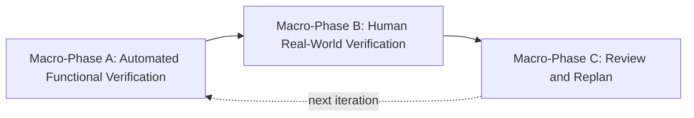

# Playwright Agent - Functional-then-Human Test Plan (v2)

This replaces the prior `.cursor/plans/playwright_agent_test_plan_87762f8b.plan.md` mental model. The old plan mixed machine-checkable code tests with vague behavioral claims. This plan fixes that by strictly splitting work into three macro-phases.

- **Macro-Phase A** = the agent does everything. Hardcoded inputs, hardcoded expected outputs, deterministic assertions, zero Y/N prompts. Either the code proves the feature works or it does not.
- **Macro-Phase B** = the human does everything. Real scenarios on the real FlowHub site. Each checkpoint asks for feedback; all answers and artifacts are captured.
- **Macro-Phase C** = review what Phase B produced, categorize, and write the next plan.

No work from A blocks B's start as long as A's gate criteria below are met.

## Core Rules (apply to both macro-phases)

- No `pass` based on "no exception raised" alone. Every task in A declares concrete machine assertions. Every task in B declares concrete human checkpoint questions.
- Credentials stay in `agent/.env.test`. Passwords never land in `stepgraph.json`, `manifest.json`, logs, or bug-log entries.
- The `playwright-agent-tester` skill governs how failures are triaged (max 3 hypotheses, HITL on design class, append-only bug log).
- Existing runners under [agent/scripts/smoke/](agent/scripts/smoke/) are reused and upgraded, not replaced. Add missing `phase_<N>.py` where absent.

---

# Macro-Phase A - Automated Functional Verification

**Goal**: prove every feature we built works, using controlled inputs we fully own. No human judgment involved. If a task in A says `pass`, that means code asserted it, not that a person eyeballed a screenshot.

## What makes a task pass in Phase A

Every Phase A task must produce all three:

1. **Hardcoded inputs** - a fixed Step Graph JSON, a fixed env, a fixed fixture page. Checked into the repo.
2. **Machine assertions** - explicit Python `assert` statements (or `_runner.case` failures) against:
   - Return values of tool calls
   - Counts and types of events in `events.jsonl`
   - Keys, structure, and redaction of exported `manifest.json`
   - SQLite row counts and values
   - Telemetry fields (`callPurpose`, `contextTier`, `cache_decision`, token counters)
   - File existence, file hashes where deterministic, file sizes where not
3. **Failure evidence bundle** - on failure, the case writes trace + screenshot + relevant events to `agent/artifacts/test-runs/<run_id>/<case_id>/` so a human can post-mortem without rerunning.

If a claim cannot be expressed as a machine assertion, it does not belong in Phase A - move it to Phase B.

## Task A0 - FlowHub-Mirror Fixture Set

The fixtures must look and behave like real pages so the tool layer, recorder, locator engine, and cache engine face realistic DOM, not toy pages.

- **A0.1** Build `agent/scripts/fixtures/app/` pages that structurally mirror FlowHub Core (`https://testing-box.vercel.app/login`) at the HTML-structure level (form layout, input names, role/aria patterns, post-login dashboard-like list view, a modal, an iframe embed, a file upload form, a multi-tab feature). Copy structure, not styling; no branding.
- **A0.2** `agent/scripts/fixtures/serve.py` serves them on `127.0.0.1:8787` via stdlib `http.server`. Add deterministic DOM mutation endpoints: `/mutate/region`, `/mutate/route`, `/mutate/modal`, `/mutate/stale-ref` (for cache invalidation and contradiction tests).
- **A0.3** Add `agent/scripts/fixtures/graphs/` with hand-authored Step Graph JSON files used as hardcoded inputs by every downstream A-phase.
- **Assertions**: server starts, every page returns 200, every mutation endpoint toggles a known DOM property, every graph in `graphs/` validates against the Step Graph pydantic schema.

## Task A1 - Foundations

Verify config, IDs, logging, SQLite migrations deterministically.

- A1.1 `Settings.load()` with valid / env-override / invalid YAML. Assert exact pydantic error messages for invalid.
- A1.2 ULID generator: 10k calls -> no duplicates, strict monotonicity, correct byte layout.
- A1.3 structlog writes to `runs/<run_id>/log.jsonl` and includes `run_id` in every line. Parse the file, assert line count and field presence.
- A1.4 `init_db()` applies all migrations, is idempotent on rerun, `schema_version` matches latest file. Downgrade attempt is rejected with clear error.

## Task A2 - Data Contracts

- A2.1 Step Graph round-trip on the 5 fixture graphs from A0.3. `model_validate(model_dump())` equal for all.
- A2.2 Instantiate every event type; JSON is deterministic (sort keys, pinned ts source).
- A2.3 Round-trip Checkpoint, CacheRecord, LearnedRepair, CompiledMemoryEntry, SchemaPolicyVersion. Assert `CacheDecision` enum exactly `{reuse, partial_refresh, full_refresh}`.

## Task A3 - Tool Layer

Against fixtures only.

- A3.1 Browser session lifecycle: start, new_context, navigate, save_storage_state, stop. Assert storage_state file is valid JSON and reusable.
- A3.2 Snapshot engine: on `dashboard.html`, capture snapshot; every listed ref resolves; after `/mutate/region`, the `ContextFingerprint` field for that region changes and others do not.
- A3.3 Core tools (navigate, click, fill, type, press, wait_for, assert_visible, assert_text, assert_url, assert_title, dialog_handle, frame_enter, frame_exit): each emits exactly one tool-call event; each returns a typed result; each is idempotent where it should be.
- A3.4 Extended tools (check, uncheck, select, upload, drag, hover, focus, assert_value, assert_checked, assert_enabled, assert_hidden, assert_count, assert_in_viewport, tabs_*, console_messages, network_requests, screenshot, take_trace): same contract.

## Task A4 - Locator Engine

- A4.1 Given a fixture page with mixed attributes, request bundles for 5 targets; assert priority ordering (testid > aria > role+name > placeholder > text > scoped CSS > xpath).
- A4.2 Confidence scoring monotonic within a bundle (primary > each fallback).
- A4.3 Stability signal: after `/mutate/region`, previously-high-confidence selectors for that region drop in confidence.

## Task A5 - Recorder (fixture-driven)

The recorder is exercised against fixtures via scripted Playwright actions, not human clicks.

- A5.1 Scripted "recording": a helper drives Playwright through a known sequence of actions; recorder captures them; resulting `stepgraph.json` matches a committed golden file (ignoring timestamps and ids).
- A5.2 Password fields are redacted in both `stepgraph.json` and `manifest.json` (assert literal password string does not appear anywhere in the files).
- A5.3 Replay of the recorded graph against the same fixture passes all deterministic assertions.

## Task A6 - Runner, Checkpoint, Resume, Manual Fix

- A6.1 Full run: assert count(`step_succeeded`) == step count, one `run_completed`.
- A6.2 Pause/resume: send pause signal mid-run; checkpoint written; resume continues at exact step_id; no prior step re-executes (assert by re-reading event offsets).
- A6.3 Deterministic retry: fixture exposes a 1-second-delayed visibility; assert `step_retried` events then `step_succeeded`, retry budget honored.
- A6.4 Manual-fix programmatic path: break a selector in a graph, run, on failure invoke the fix API with a known replacement, assert `intervention_recorded` then `run_resumed`.
- A6.5 Durability: SIGKILL mid-run; resume from checkpoint works; events file remains parseable.

## Task A7 - Cache and Invalidation

All deterministic via fixture mutation endpoints.

- A7.1 Repeat the same graph twice on an unchanged page; assert second-run decision histogram is mostly `reuse`.
- A7.2 `/mutate/region` between steps -> assert `partial_refresh` on the mutated scope only.
- A7.3 `/mutate/route` -> assert `full_refresh`.
- A7.4 `/mutate/stale-ref` -> assert invalidation and repair path triggers.

## Task A8 - Memory Layer

- A8.1 Raw evidence: attempt mutation -> rejected; file grows append-only.
- A8.2 Compiled memory: two upserts with different payloads -> version increments, provenance links correct.
- A8.3 Learned repair promotion/demotion: simulate N successes -> `candidate` -> `trusted`; N failures -> `trusted` -> `degraded`.
- A8.4 Contradiction resolver: inject conflicting selectors; assert classification is one of `{stale_locator, content_drift, structure_drift}` and configured policy output matches expected for each of `{accept_new, keep_old, dual_track_with_fallback, require_manual_review}`.

## Task A9 - LLM Layer (mock-first)

Real provider tests are in Phase B. Here we use recorded fixtures.

- A9.1 Record real responses from OpenAI, Anthropic, and OpenAI-compatible once into `agent/scripts/fixtures/llm_cassettes/` (this recording itself is a one-time manual step noted in PORTING_NOTES.md). All subsequent A9 tests replay from cassettes.
- A9.2 Each adapter emits one `LLMCall` row with correct `provider`, `model`, `callPurpose`, `contextTier`, token counts.
- A9.3 Tier escalation: contrive a failing step such that Tier 0 cannot resolve. Assert escalation path `tier0 -> tier1 -> tier2`, and that Tier 3 fires only when explicitly forced.
- A9.4 No-progress budget guard: contrive a non-progressing loop; assert orchestrator halts within policy budget and emits an escalation event.
- A9.5 Mode switch: start Hybrid, toggle via API; assert `mode_switched` events with actor and reason; browser session and checkpoint stay intact.

## Task A10 - Policy and Security

- A10.1 Approval classifier: enumerate every action type, assert classification map matches `docs/07`.
- A10.2 Hard-approval path: simulated submit must block until approval callback fires; denial path aborts with `run_aborted`; approval path continues.
- A10.3 Restrictions: disallowed domain, disallowed upload root, `file://` path all rejected with reason codes.
- A10.4 Audit completeness: after a scripted full run, assert every approval, mode switch, tool call, intervention, retry has an audit entry with actor and parameters.

## Task A11 - Export

- A11.1 Confidence gating: graphs with per-step confidences 0.6/0.75/0.9 produce block/review/allow exactly. Block reasons are machine-readable.
- A11.2 Manifest: assert schema conformance and that no value fields from password inputs leak.
- A11.3 `.spec.ts` generator: export from a fixture recording, then run `npx playwright test` against the fixture server; assert spec passes.

## Task A12 - Benchmark

- A12.1 KPI coverage: after a scripted full run, `agent report` produces every KPI in `docs/08`. Assert each KPI key is present.
- A12.2 Bench harness: run the same graph under Manual / LLM(replay from cassette) / Hybrid; assert aggregation buckets match definitions.

## Task A13 - Integration Chain E2E (fixture)

One hardcoded chain exercises the whole pipeline, not individual features.

- A13.1 Input: `agent/scripts/fixtures/graphs/fixture_login_and_navigate.json`.
- A13.2 Record the scripted flow against fixtures -> Replay in Manual -> Run again and assert cache reuse -> Break a selector -> Replay in LLM(cassette) mode -> Assert repair learned -> Export manifest -> Verify `.spec.ts` passes against fixtures.
- A13.3 Machine assertions across all events, telemetry, and files at each stage.

## Gate: Phase A is green

Phase B does not start until:

- Every Task A1 through A13 passes on a clean checkout.
- `agent/artifacts/test-runs/<last>/bugs.jsonl` has zero open `runtime` or `logical` bugs.
- `PORTING_NOTES.md` flags any features intentionally left untested in A and moved to B.

**Machine runner:** from `agent/`, `uv run python scripts/smoke/gate_a.py` runs A0–A13 in order and checks bug logs written during that run; `uv run python scripts/smoke/gate_a.py --quick` skips optional `npx playwright` / browser bench steps (see `PORTING_NOTES.md` Gate A).

---

# Macro-Phase B - Human Real-World Verification

**Goal**: the human uses the tool as intended, on the real FlowHub site, following scripted scenarios with checkpoint questions. Capture everything.

This is the only place human judgment is collected. The agent is a driver and a data recorder here, not a reviewer.

## Session infrastructure

- B0.1 `agent/scripts/human/_session.py` starts a human-test session. Creates `agent/artifacts/human-sessions/<session_id>/` with `events.jsonl`, `screenshots/`, `traces/`, `answers.jsonl`.
- B0.2 `_session.py` prompts the operator with **one question at a time**, shows the artifact path (open-in-editor link if possible), and stores the answer in `answers.jsonl` as `{ checkpoint_id, question, answer (y/n/skip/free_text), free_text_note, ts }`.
- B0.3 Session start records environment snapshot: git sha, agent version, python version, browser version, config used, target URL.

## Scenarios (each is a small scripted workflow with checkpoints)

Each scenario sets up, waits for the human to drive a step, then asks a checkpoint question before continuing.

- **B1 - First-time record**: operator records login on FlowHub. Checkpoints: "Did the recorder capture all 3 actions? (Y/N)", "Is the password redacted in the stepgraph? (Y/N)", "Does the final screenshot show the post-login screen? (Y/N)".
- **B2 - Deterministic replay**: operator runs the recorded graph. Checkpoints: "Did all steps succeed without intervention?", "Did the end state match what you expected?".
- **B3 - Storage-state reuse**: operator replays with saved storage state. Checkpoint: "Did it skip the login steps?".
- **B4 - Cache reuse**: operator replays twice. Checkpoints: "On the second run, did the cache decision log show mostly `reuse`?", "Was the replay faster?".
- **B5 - LLM healing**: operator edits one selector to be wrong. Checkpoints: "Did LLM mode finish the run?", "Was the repair reasonable? (Y/N + free text)".
- **B6 - Hybrid mid-run toggle**: operator starts Manual, forces a failure, toggles LLM for one step, toggles back. Checkpoints: "Did the toggle not reset the session?", "Did the repaired step succeed?".
- **B7 - Export and downstream LLM**: operator exports manifest + `.spec.ts`, opens a fresh Cursor Chat, attaches both, asks the chat to add one more step. Checkpoints: "Did the downstream LLM understand the manifest?", "Did the extended spec pass after you applied it?".
- **B8 - Cross-session persistence**: operator runs the same flow the next day. Checkpoints: "Did learned repairs from the previous session still apply?".
- **B9 - Real-world chaos**: operator tries one thing outside the scripted scenarios (anything they actually want the tool to do). Free-text feedback captured.

Each scenario ends with a final free-text question: "What surprised you? What frustrated you? What was missing?".

## Deliverable of Phase B

A single `agent/artifacts/human-sessions/<session_id>/session_report.md` produced automatically from `answers.jsonl` and artifacts. Contains:

- Per-scenario Y/N outcomes
- Free-text answers verbatim
- Links to every screenshot and trace
- Environment snapshot

Phase B produces feedback; it does not decide fixes.

---

# Macro-Phase C - Review and Replan

**Goal**: consume Phase B's session report, categorize findings, and emit the next plan. No code changes happen in Phase C.

## Tasks

- C1 Read all `answers.jsonl` entries and free-text notes.
- C2 Categorize every item into exactly one of:
  - `bug` - feature was meant to work and did not
  - `design` - feature worked as built but the design is wrong
  - `missing` - capability not yet built
  - `enhancement` - works, could be better
  - `out-of-scope` - not in the product scope
- C3 Produce `docs/reviews/<session_id>-review.md` with the categorized list, links back to artifacts, and one proposed action per item.
- C4 Human and agent discuss the review; decisions recorded inline.
- C5 Emit the next plan in `.cursor/plans/` - either a patch to this plan or a fresh `playwright_agent_plan_vN.plan.md`. The new plan explicitly references the review doc it came from.

---

## Ordering and Parallelism

- A1 through A13 are sequential for safety, but A3/A4/A9 sub-tasks can be parallelized across subagents if needed.
- B starts only after the Phase A gate is green.
- C is always single-threaded.

## What Is NOT in Scope

- Load testing, concurrency, multi-user. Out of product scope.
- Enterprise security fuzzing beyond what `docs/07` already defines.
- Shadow DOM coverage beyond `docs/06`'s v1 matrix.
- Visual regression on real FlowHub beyond "does the screenshot look right" Y/N in Phase B.

## Open Decisions

- Whether to commit LLM cassettes (recorded provider responses) to the repo or keep them local. Default: commit under `agent/scripts/fixtures/llm_cassettes/` with any PII scrubbed, since they are needed for A9 reproducibility.
- Whether Phase B's "free-text" answers go through an LLM summarizer before Phase C. Default: no - raw human text into C1.