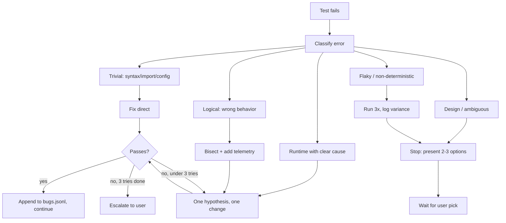

# Playwright Agent — Test & Debug Plan

## Goals

1. Prove every feature actually works end-to-end against a real browser and real Step Graphs, not just import-and-construct smoke.
2. Validate all three runtime modes (Manual, LLM-orchestrated, Hybrid) and the mid-run toggle.
3. Cover the product's actual use case: record a session, extract locators + Playwright code, export to another LLM for extension, re-validate. Nothing beyond that scope.
4. Replace ad-hoc debugging with a **systematic triage protocol** driven by the new `playwright-agent-tester` skill.

## Testing Priority (fixed order)

```
1. Functional happy path (per feature)
   --> 2. Integration across features (record -> replay -> cache -> export)
       --> 3. Mode matrix (Manual / LLM / Hybrid + mid-run toggle)
           --> 4. Resilience (pause/resume/fix, cache invalidation, contradictions)
               --> 5. Lightweight edges (bad input, missing config, auth drift)
```

Step 5 stops the moment Step 1-4 are stable. We do not pursue exhaustive edge coverage.

## Deliverables

- **Skill**: `.cursor/skills/playwright-agent-tester/SKILL.md` (new). Enforces triage + HITL rules while any agent runs tests from this plan.
- **Test plan** (this document): phase-by-phase tasks in `.cursor/plans/`.
- **Test runners**: upgrade existing [agent/scripts/smoke/phase_1.py](agent/scripts/smoke/phase_1.py), [agent/scripts/smoke/phase_9.py](agent/scripts/smoke/phase_9.py), [agent/scripts/smoke/phase_10.py](agent/scripts/smoke/phase_10.py), and add missing `phase_2.py`..`phase_13.py` under [agent/scripts/smoke/](agent/scripts/smoke/). No parallel `test/` tree.
- **Bug log**: `agent/artifacts/test-runs/<ts>/bugs.jsonl` — one line per triaged bug with classification, hypothesis, fix (or escalation).

## Systematic Debug Protocol (enforced by the skill)

Every failure MUST go through this triage before any code change:

```
Failure
  |
  v
Classify
  |-- syntax / import / typo              -> fix directly, re-run
  |-- config / missing env / missing path -> fix directly, re-run
  |-- runtime (clear root cause)          -> 1 hypothesis, 1 change, re-run
  |-- logical (behavior wrong)            -> bisect + add telemetry, then hypothesis
  |-- design / ambiguous                  -> STOP. Present 2-3 options with trade-offs. Ask user.
  |-- flaky (non-deterministic)           -> run 3x, log variance, escalate if > 1 failure
```

**Loop guard**: max 3 failed hypotheses per bug before mandatory escalation to the user. No shotgun fixes.

**HITL triggers (skill must force a stop and ask)**:
- Any bug classified `design` or `ambiguous`.
- Any fix that requires editing a pydantic contract under [agent/src/agent/stepgraph/models.py](agent/src/agent/stepgraph/models.py), [agent/src/agent/execution/events.py](agent/src/agent/execution/events.py), [agent/src/agent/cache/models.py](agent/src/agent/cache/models.py), or [agent/src/agent/memory/models.py](agent/src/agent/memory/models.py).
- Any fix that would skip a risk-gate condition from the build plan.
- Any bug that reappears after being marked fixed in `bugs.jsonl`.



---

## Phase Structure

Each test phase follows: **Goal / Preconditions / Sub-tasks / Expected outcome / Bug-log key**.

Tests reference CLI surface at [agent/src/agent/cli/__main__.py](agent/src/agent/cli/__main__.py) (`record`, `run`, `resume`, `pause`, `fix`, `mode`, `report`, `bench`, `export`).

Two target environments:

1. **Primary (live SaaS)**: `https://testing-box.vercel.app/login` (FlowHub Core - SDET Edition) with credentials `admin1@test.com` / `Test123!@#`. Used for the real-world E2E acceptance gate (T12) and for recorder / LLM healing / Hybrid tests where realistic DOM and network conditions matter.
2. **Secondary (offline fixture)**: a tiny static app served from `agent/scripts/fixtures/app/` at `127.0.0.1:8787`. Used for deterministic tests of dialogs / iframes / upload / tabs / stale-ref / cache invalidation — anything that requires controllable DOM mutations or offline runs.

Credentials are read from env (`FLOWHUB_EMAIL`, `FLOWHUB_PASSWORD`), loaded by the test runner from `agent/.env.test` (gitignored). Never hard-code creds in scripts or commit them.

---

## Phase T0 — Test Harness Bootstrap

### Task T0.1 — Targets setup (live + offline fixture)
- **Goal**: two stable test targets, with a single helper that selects between them.
- **Sub-tasks**:
  1. **Live target wiring**:
     - Add `agent/.env.test.example` with keys `FLOWHUB_URL=https://testing-box.vercel.app/login`, `FLOWHUB_EMAIL=`, `FLOWHUB_PASSWORD=`.
     - Runner loads `agent/.env.test` via `python-dotenv`; fail fast with a clear message if missing.
     - Add `agent/scripts/fixtures/live.py` exposing `live_target()` returning a `TargetInfo(url, email, password)` object.
     - Add `agent/.env.test` to `.gitignore` (verify existing gitignore covers it; if not, add).
  2. **Offline fixture app**:
     - Create `agent/scripts/fixtures/app/` with static pages: `login.html`, `dashboard.html`, `iframe_parent.html` + `iframe_child.html`, `dialogs.html`, `dynamic_list.html`, `upload.html`, `tabs.html`.
     - `agent/scripts/fixtures/serve.py` (stdlib `http.server`) on `127.0.0.1:8787`.
     - `agent/scripts/fixtures/__init__.py` exposing `start_server()` / `stop_server()` context manager.
  3. **Target selector**: helper `choose_target(kind: Literal["live","offline"])` that returns either live or local URL, so each test task picks the right one explicitly.
- **Expected**: `python -m agent.scripts.fixtures.serve` serves pages locally; `python -c "from agent.scripts.fixtures.live import live_target; print(live_target())"` prints the URL (never the password).

### Task T0.2 — Bug log format + helper
- **Goal**: consistent, machine-readable triage records.
- **Sub-tasks**:
  1. Add `agent/src/agent/testing/bug_log.py` with a `BugEntry` pydantic model: `id`, `ts`, `phase`, `task`, `feature`, `error_class` (`syntax|config|runtime|logical|design|flaky`), `summary`, `hypothesis`, `change`, `outcome`, `user_decision?`, `artifact_refs[]`.
  2. Writer appends to `agent/artifacts/test-runs/<run_id>/bugs.jsonl`.
- **Expected**: skill + smoke scripts write to the same log format.

### Task T0.3 — Test runner utility
- **Goal**: uniform entry for every phase test script.
- **Sub-tasks**:
  1. Add `agent/scripts/smoke/_runner.py` with `case(name)` context manager that times, captures stdout/stderr, routes failures through the bug-log helper, and prints a per-case PASS/FAIL summary.
  2. Migrate existing `phase_1.py`, `phase_9.py`, `phase_10.py` to use it.
- **Expected**: `python -m agent.scripts.smoke.phase_1` prints a table with pass/fail and appends failures to `bugs.jsonl`.

---

## Phase T1 — Foundations (config, IDs, logging, storage)

### Task T1.1 — Config loader
- Verify [agent/src/agent/core/config.py](agent/src/agent/core/config.py) loads `default.yaml`, merges env, rejects invalid YAML with a clear pydantic error.
- **Expected**: 3 cases (valid, env override, invalid) all behave.

### Task T1.2 — IDs
- Verify [agent/src/agent/core/ids.py](agent/src/agent/core/ids.py) produces unique monotonic `run_id` / `step_id` / `event_id` across 10k generations.
- **Expected**: no duplicates, strictly increasing.

### Task T1.3 — Logging
- Verify structured logs emit to console and `runs/<run_id>/log.jsonl`, and include `run_id`.

### Task T1.4 — SQLite + migrations
- Verify `init_db()` creates all tables, re-running is a no-op, `schema_version` row matches latest file, migrations apply in order.

---

## Phase T2 — Data Contracts

### Task T2.1 — Step Graph round-trip
- Build a 5-step graph (click, fill, wait, assert, navigate), serialize, deserialize, compare.

### Task T2.2 — Event types
- Instantiate each of the 10 event types; assert JSON is deterministic and includes `event_id`, `ts`, `run_id`.

### Task T2.3 — Checkpoint + cache + memory models
- Round-trip `Checkpoint`, `CacheRecord`, `LearnedRepair`, `CompiledMemoryEntry`. Validate `CacheDecision` enum members.

---

## Phase T3 — Tool Layer (core + extended)

### Task T3.1 — Browser session lifecycle
- Start → new_context → navigate → save_storage_state → stop. Verify storage state file written and reusable.

### Task T3.2 — Snapshot engine
- On `dashboard.html`, capture snapshot; verify refs resolve back to ElementHandles; verify `ContextFingerprint` changes after DOM mutation.

### Task T3.3 — Core tool functions
- Against the fixture app: `navigate`, `click`, `fill`, `type`, `press`, `wait_for`, `assert_visible`, `assert_text`, `assert_url`, `assert_title`, `dialog_handle` (accept + dismiss + promptText), `frame_enter`/`frame_exit`.
- **Expected**: every tool returns typed result; each emits one tool-call event.

### Task T3.4 — Extended tool functions
- `check`, `uncheck`, `select`, `upload`, `drag`, `hover`, `focus`, remaining assertions (`value`, `checked`, `enabled`, `hidden`, `count`, `in_viewport`), `tabs_*`, `console_messages`, `network_requests`, `screenshot`, `take_trace`.

### Task T3.5 — Locator engine
- Given a fixture page with mixed attributes, request LocatorBundles for 5 targets; verify priority order in [agent/src/agent/locator/engine.py](agent/src/agent/locator/engine.py) (testid > aria > role+name > placeholder > text > scoped CSS > xpath) and confidence ordering.

---

## Phase T4 — Recorder

### Task T4.1 — Record round-trip (live site)
- `agent record --url https://testing-box.vercel.app/login`, perform: fill email (`$FLOWHUB_EMAIL`), fill password (`$FLOWHUB_PASSWORD`), click submit, wait for post-login URL or a known dashboard element.
- Verify `stepgraph.json` + `manifest.json` written and that secrets are **not** present in either file (locator-only, not values — or values redacted).

### Task T4.2 — Replay of recorded graph (live site)
- `agent run <stepgraph.json>` against `https://testing-box.vercel.app/login`. All steps succeed; session reaches logged-in state.

### Task T4.3 — Recorder spike findings check
- Confirm `PORTING_NOTES.md` recorder-section assumptions still hold after Phase 6 ship.

---

## Phase T5 — Runner, Checkpoint, Pause/Resume, Manual Fix

### Task T5.1 — Full run
- Execute a multi-step graph; every step emits `step_started` + `step_succeeded`; `run_completed` at end.

### Task T5.2 — Pause + resume
- Mid-run SIGINT (or `agent pause`); confirm checkpoint written; `agent resume <run_id>` continues from the exact Step ID; no re-execution of prior successful steps.

### Task T5.3 — Deterministic retry
- Force a transient failure (introduce a 1-sec delayed visibility in fixture); verify retry budget + eventual success with `step_retried` events.

### Task T5.4 — Manual fix + force fix
- Intentionally break a selector in the Step Graph; run; on failure use `agent fix` to pick a replacement; verify `intervention_recorded` and `run_resumed`.

### Task T5.5 — Kill-and-resume durability
- `kill -9` the runner; resume must still work from last checkpoint. Events must be append-only consistent.

---

## Phase T6 — Cache & Invalidation

### Task T6.1 — Reuse on stable page
- Run the same graph twice against an unchanged page. Second run's cache decisions should be mostly `reuse`. Assert via [agent/src/agent/cache/engine.py](agent/src/agent/cache/engine.py) telemetry in events.

### Task T6.2 — Partial refresh on scoped mutation
- Mutate one region between steps (fixture exposes a button that swaps a subtree); expect `partial_refresh` for that scope, not `full_refresh`.

### Task T6.3 — Full refresh on route change
- Navigate between fixture pages; expect `full_refresh`.

### Task T6.4 — Stale ref handling
- Force a ref mismatch; expect invalidation + retry path.

---

## Phase T7 — Memory Layer

### Task T7.1 — Raw evidence append-only
- Try to mutate a raw record; operation must be rejected; file grows append-only.

### Task T7.2 — Compiled memory versioning
- Upsert the same compiled entry twice with different payloads; verify version increments and provenance links back to raw IDs.

### Task T7.3 — Learned repair promotion
- Simulate N successful manual fixes on the same scope key; verify promotion `candidate -> trusted` and demotion `trusted -> degraded` on N failures.

### Task T7.4 — Contradiction resolver
- Inject conflicting selectors on the same `domain + routeTemplate + frameContext + targetSemanticKey`. Verify classification (`stale_locator` / `content_drift` / `structure_drift`) and that the configured policy (default `dual_track_with_fallback`) is applied.

---

## Phase T8 — LLM Layer

### Task T8.1 — Provider adapters
- Using [agent/src/agent/llm/provider.py](agent/src/agent/llm/provider.py) and [agent/src/agent/llm/openai_compatible.py](agent/src/agent/llm/openai_compatible.py), run the same simple prompt through OpenAI, Anthropic, and an OpenAI-compatible endpoint (LM Studio mock or real).
- **Expected**: all three return; each emits one `LLMCall` row with tokens, `callPurpose`, `contextTier`.

### Task T8.2 — Staged context escalation
- Plan a failing step with Tier 0 context; confirm orchestrator escalates to Tier 1 then 2 only when unresolved; no unnecessary Tier 3.

### Task T8.3 — Mode switch mid-run
- Start Hybrid run; toggle LLM ON then OFF with [agent/src/agent/cli/mode_cmd.py](agent/src/agent/cli/mode_cmd.py); browser session and checkpoint must not reset; `mode_switched` events logged with actor + reason.

### Task T8.4 — No-progress budget guard
- Force a loop where LLM cannot make progress; confirm the budget guard halts and escalates per policy rather than burning tokens indefinitely.

---

## Phase T9 — Policy & Security

### Task T9.1 — Approval classifier
- For each action type in [agent/src/agent/policy/approval.py](agent/src/agent/policy/approval.py), verify `auto_allow` / `review` / `hard_approval` classification.

### Task T9.2 — Hard-approval prompts
- On a hard-approval action (simulated submit), CLI must block and prompt; deny once, approve once; audit entries created.

### Task T9.3 — Restrictions
- Attempt disallowed domain, disallowed upload root, `file://` path; each must be blocked with a clear reason and logged.

### Task T9.4 — Audit log completeness
- Inspect audit log after a full run; every approval, mode switch, tool call, intervention, retry is present with actor and parameters.

---

## Phase T10 — Export

### Task T10.1 — Confidence gating
- Craft graphs with step confidences `0.6`, `0.75`, `0.9`. Verify `<0.70` blocks, `0.70-0.85` review-gated, `>=0.85` allowed. Block reasons are machine-readable.

### Task T10.2 — Portable manifest
- Export a run; open `manifest.json`; verify it contains Step Graph + locator bundles + fingerprints + provenance and nothing more.

### Task T10.3 — Playwright spec generator
- Export a recorded login flow as `*.spec.ts`; run it with `npx playwright test` against the fixture app. The generated spec should pass unchanged.

### Task T10.4 — LLM hand-off shape
- Confirm the export package (manifest + generated code + locator bundles) is consumable by a second LLM agent given only these files — run a manual "add a new step" round-trip and confirm the downstream LLM can extend the flow.

---

## Phase T11 — Benchmark Report

### Task T11.1 — KPI coverage
- Run a scripted flow; `agent report <run_id>` via [agent/src/agent/cli/report_cmd.py](agent/src/agent/cli/report_cmd.py) should compute every KPI in `docs/08` (tokens/step, cost/flow, cache hit rate, tier-0/1 resolution ratio, contradiction rate).

### Task T11.2 — Experiment harness
- `agent bench` runs the same graph under Manual / LLM / Hybrid; with/without storage-state; with/without learned repairs. Output aggregates match KPI definitions.

---

## Phase T12 — End-to-End Product Flow (the real use case)

This is the acceptance gate. Target: `https://testing-box.vercel.app/login` (FlowHub Core - SDET Edition).

### Task T12.1 — Record a real flow on FlowHub
- `agent record --url https://testing-box.vercel.app/login`.
- Perform: login with `admin1@test.com` / `Test123!@#`, navigate to one feature area of the app (e.g. a list / search / detail), click through 2-3 meaningful actions, stop.
- Verify `stepgraph.json` + `manifest.json` written. Secrets stay out of both files (use recorder's redaction/placeholder for password fields).

### Task T12.2 — Replay in Manual mode
- Replay the recorded graph deterministically against the live site. Must complete without LLM.
- Storage-state reuse on re-run should skip the login steps when configured.

### Task T12.3 — Replay in LLM mode with intentional drift
- Manually edit the Step Graph to use an outdated selector on one post-login element. Run in LLM mode. Orchestrator must repair and finish. Repair persisted as a learned repair with scope key on `testing-box.vercel.app`.

### Task T12.4 — Hybrid mid-run assist
- Start Manual; force a failure (bad selector on one step); toggle LLM ON for that step only via `agent mode set llm`; once fixed, toggle back OFF; run completes without losing session or checkpoint.

### Task T12.5 — Export + downstream LLM extension
- Export the FlowHub run's manifest + `.spec.ts`. Open a fresh Cursor Chat tab, attach the export files, and ask it to add one new step (e.g. "after the first action, also assert the URL contains `/dashboard`"). Apply the returned code. Re-run. Pass.

### Task T12.6 — End-to-end report
- Produce `agent/artifacts/test-runs/<ts>/final_report.md`: pass/fail per phase, bugs from `bugs.jsonl`, KPI summary from `agent report`, and follow-ups.

---

## Phase T13 — Lightweight Edges (only after T1-T12 pass)

Single pass, no deep fuzzing:

- Bad input: malformed `stepgraph.json` -> clean error, no crash.
- Missing `.env` / provider key -> LLM mode refuses gracefully; Manual mode still runs.
- Auth drift: storage_state expired -> clear classification + fallback.
- Very long wait conditions: bounded timeout + fallback check triggers.
- Disk full on `runs/` -> graceful abort with checkpoint preserved.

---

## Test Execution Ordering

```
T0 -> T1 -> T2 -> T3 -> T4 -> T5 -> T6 -> T7 -> T8 -> T9 -> T10 -> T11 -> T12 -> T13
```

Any failure in T1-T5 blocks later phases. T6-T11 can be executed in parallel by separate agents once T5 is green, but T12 is always last.

## Done Criteria for the Whole Plan

- All tasks T0-T12 pass with the runner's exit code 0.
- `bugs.jsonl` contains zero entries with `outcome="escalated-unresolved"`.
- T13 completes a single pass (warnings allowed, no crashes).
- `final_report.md` is generated.

---

## New Skill: `playwright-agent-tester`

Created at `.cursor/skills/playwright-agent-tester/SKILL.md`. Contents (to be written during execution, not now):

- **Trigger description**: "Drives test execution and systematic debugging for the Playwright agent. Use when running any `agent/scripts/smoke/phase_*.py`, investigating failures in `agent/`, or when the user mentions testing, debugging, triage, or bug log."
- **Authoritative sources**: the test plan above; `docs/`; existing build plan.
- **Hard rules** (mirror the build skill's style):
  1. Never edit a pydantic contract without user approval.
  2. Follow the triage flow; append to `bugs.jsonl` before every fix.
  3. Max 3 hypotheses per bug; then escalate.
  4. HITL triggers (design/ambiguous/contract-edit/repeat-bug) must STOP and call `AskQuestion` with 2-3 labeled options and trade-offs.
  5. No shotgun refactors. One hypothesis, one change, one re-run.
  6. No parallel `test/` directory; use `agent/scripts/smoke/phase_<N>.py`.
- **Model policy** (aligned with build skill):
  - Test execution + trivial fixes -> `gpt-5.4-mini-medium`
  - Runtime/logical debugging -> `gpt-5.3-codex-high`
  - Design/ambiguous decisions -> `claude-4.6-sonnet-medium-thinking` (present options)
  - Exploration subagents -> `composer-1.5`
- **Completion protocol**: after each test phase, respond in fixed 4-section format (Phase complete / Cases run / Bugs opened / Next phase).
- **Working loop** checklist: load plan -> pick next phase -> run cases -> on each failure run triage -> write bug log -> stop at HITL -> mark phase done -> hand off.

---

## Target per Phase (quick reference)

- **Offline fixture only** (deterministic): T1, T2, T3, T5, T6, T7, T9, T13.
- **Live FlowHub site**: T4, T12 (acceptance gate).
- **Either** (agent chooses; default live): T8, T10, T11. Live preferred for LLM/export/bench because the DOM is realistic.

## Open Decisions (captured, not blocking)

- Whether to wire `bugs.jsonl` into the benchmark report. Default: not in T11; add later if useful.
- Whether to enable Playwright trace recording by default on live-site runs. Default: ON in T12 only, to keep evidence for acceptance but avoid disk bloat in other phases.